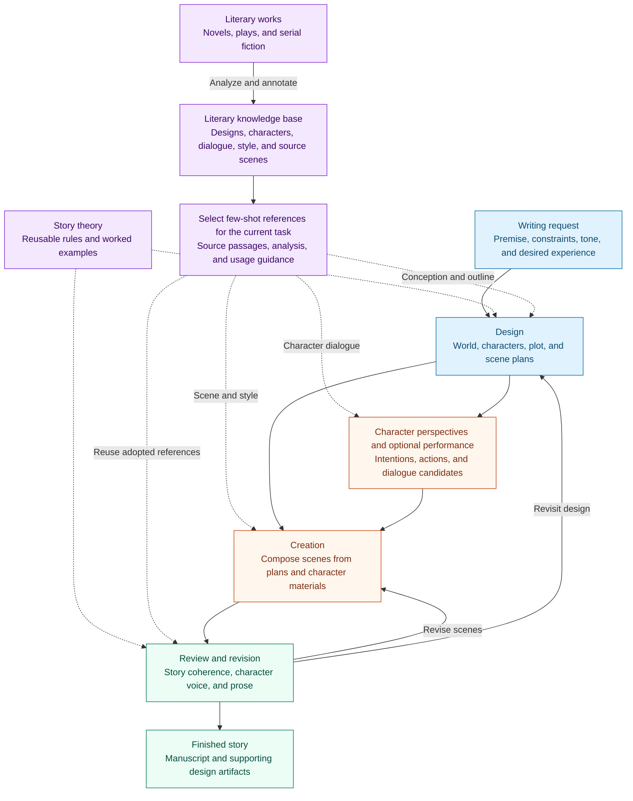

<div align="center">

# MUSE

**A Theory-Harnessed Story Engine for Vibe Narrativizing**

[简体中文](README.md) | **English**

From a writing request to a finished story, with narrative theory guiding the decisions along the way.

[Story theory](#how-mckees-theory-guides-writing) · [Literary knowledge base](#literary-knowledge-base-and-few-shot-guidance) · [How it works](#how-it-works) · [Skill packages](#skill-packages) · [Quick start](#quick-start) · [Repository guide](#repository-guide)

</div>

MUSE turns natural-language writing requirements into fiction through planning, character performance, scene composition, and revision. It connects Robert McKee's story theory with a literary knowledge base and reusable writing skills, then carries each story's decisions forward through a shared workspace.

We call this task **Vibe Narrativizing**: describe the story you want—its premise, relationships, key events, atmosphere, and prose style—and develop those intentions into a complete narrative.

The repository includes workflows for **original fiction, screenplays, serial and derivative fiction**, together with tools for analyzing literary works and retrieving writing references. Most skill instructions and knowledge-base annotations are in Chinese; the [skills collection](skills/README.md) includes a corpus guide and direct links to English source material.

## How McKee's theory guides writing

Robert McKee's *Story* examines how events, characters, and structure create narrative meaning. *Dialogue* develops the account of speech as action. MUSE draws on these principles to guide concrete decisions in story design, character performance, and revision.

| Narrative principle | The writer's question | Application in MUSE |
|---|---|---|
| **Desire and choice under pressure** | What does the character want now, what will they sacrifice, and where will they hesitate? | Character design establishes pursuits and relationships; scene-specific materials develop immediate intentions and actions |
| **The gap between action and outcome** | How does the world's response depart from the character's expectations and force a new approach? | Plot and scene design connect actions, consequences, and subsequent choices |
| **Value change within a scene** | What changes in trust, freedom, safety, or intimacy by the end of the scene? | Scene plans identify the change; prose realizes it through events and reactions |
| **Dialogue as action and subtext** | Is the speaker probing, reassuring, demanding, or evading? What intention remains unspoken? | Character performance and dialogue craft coordinate speech, physical action, and changing relationships |
| **Climax and controlling idea** | What does the final choice bring about, why does it happen, and what understanding emerges? | Conception establishes a direction; structure and ending develop its meaning through character action |

For example, a reporter trying to clear her father's name discovers that he helped falsify the records. The evidence changes her situation and forces a choice between revealing the truth and protecting her family. Character desire, plot development, and story meaning grow from the same relationship between action and consequence.

MUSE organizes these principles into phase-specific skills, character materials, and review methods. The project supplies the file structures, orchestration, and adaptations for fiction and serial writing. Explore the skill references on [premise and controlling idea](skills/MUSE-writing/skills/phase0-conception/references/mckee-premise.md), [character design](skills/MUSE-writing/skills/phase2-character/references/mckee-character.md), [scene design](skills/MUSE-writing/skills/phase5-scene-arrangement/references/mckee-scenes.md), and [subtext](skills/MUSE-writing/skills/dialogue-craft/references/subtext-theory.md) (in Chinese).

## Literary knowledge base and few-shot guidance

MUSE's literary knowledge base organizes the structure, characters, scenes, and language of novels, plays, and serial fiction into retrievable writing references. **Few-shot guidance means placing a small selection of relevant examples in the current creative context, so the model can learn from source passages and their analysis.** Theory supplies principles for creative decisions; literary examples show how those principles take shape in particular characters, situations, and prose.

The analysis assets connect whole-story and phase-specific designs, character materials, source scenes, style profiles, beat-level craft notes, and inspiration cards that explain narrative mechanisms. Dialogue events also preserve consecutive exchanges and their relationship, pressure, and speech actions for character performance.

| Creative stage | Knowledge-base materials | Decisions they support |
|---|---|---|
| **Conception and thematic development** | Source premises, inspiration cards, relevant passages, and mechanism analysis | Which relationship, situation, or image can carry the intended experience |
| **World, outline, and plot design** | World rules, plot spines, sequence structures, and scene analyses | How to establish causal conditions, develop conflict, and arrange revelations and climaxes |
| **Character design and performance** | Character profiles, behavioral evidence, and consecutive dialogue exchanges | How a character chooses, responds, and speaks under the current relationship and pressure |
| **Scene composition and prose** | Source scenes, style cards, and beat-level craft annotations | How to organize action, turns, narrative distance, sentence rhythm, and omission |
| **Review and revision** | Adopted references, design decisions, and the resulting prose | Which creative intentions need further development and how to revise style and scene execution |

References are selected for the **current creative problem**. Design retrieval examines source mechanisms and the conditions that make them work; scene retrieval considers the situation and desired prose register; dialogue retrieval considers relationships, pressure, and response goals. Selected passages, analysis, and usage guidance enter the run's workspace and reach the relevant role. Inspiration adopted during design travels with the outline into composition, while revision continues to use the active references within their adopted scope.

For a fairy tale that conveys a secret under surveillance, a writer can start with the [dual-meaning inspiration card](skills/MUSE-canon-distill/knowledge-base/inspiration/double-layer-code-speech.yaml), examine the [craft analysis of the corresponding scene in *Death's End*](skills/MUSE-canon-distill/knowledge-base/novels/三体Ⅲ-死神永生/craft_notes/scene_S26_beats.yaml), and read the [source scene](skills/MUSE-canon-distill/knowledge-base/novels/三体Ⅲ-死神永生/scenes/scene_S26.md). Together, these materials connect the narrative mechanism to the placement of repetition, objects, and omissions, then to the resulting reading experience. The new story develops those choices through its own characters, world, and the author's intended use of the reference.

Explore the entrypoints for [design references](skills/MUSE-canon-distill/skills/design-doc-reference/SKILL.md), [character dialogue references](skills/MUSE-canon-distill/skills/dialogue-reference/SKILL.md), and [scene references](skills/MUSE-canon-distill/skills/scene-reference/SKILL.md), or browse the [corpus guide](skills/README.md#knowledge-base). Most reference materials are in Chinese.

## How it works

MUSE addresses two connected questions: **what guidance helps a model make a creative decision, and how does that decision continue to shape the story?** Knowledge engineering organizes principles and examples into task-specific skills. An agent harness—the roles, tools, shared files, and handoffs around model calls—connects those skills to the work of writing.

The full story workflow brings five responsibilities together: literary reference, design, character performance, creation, and review.



**Design makes the story's commitments concrete.** The complete fiction workflow develops a premise, world, characters, plot spine, sequence structure, and scene plans. A planned climax determines what earlier conflicts must establish; each scene develops a consequential change.

**Character performance supplies material for the writer.** Scene-specific intentions and pressures produce possible actions, reactions, and lines. The writer composes these materials into a scene, choosing pacing, viewpoint, detail, and dialogue.

**Context follows creative responsibility.** Design roles read the premise and prior designs; character performance uses the situation as that character knows it; writers receive scene plans, character materials, and current references; reviewers compare prose with its design. The shared workspace preserves artifacts, and each handoff selects the materials needed for the next task.

**Review feeds back into the work.** Scene and whole-story review guide revisions to prose or design. Serial workflows also record chapter summaries, world facts, character history, and unresolved threads for the next chapter.

## Skill packages

| Package | Use it for | Main deliverables |
|---|---|---|
| [MUSE-writing](skills/MUSE-writing/README.md) | Original short and medium-length fiction; original or adapted screenplays | Story designs, character materials, drafts, reviews, and a finished manuscript |
| [MUSE-canon-distill](skills/MUSE-canon-distill/README.md) | Analyzing novels and plays; finding structural, character, dialogue, and style references | Scene analyses, character reference packages, inspiration cards, and retrieval assets |
| [MUSE-serial-writing](skills/MUSE-serial-writing/README.md) | Serial fiction, fan fiction, sequels, spin-offs, and stylistic adaptations | Series and volume plans, chapters, continuity records, and persistent series state |
| [MUSE-serial-distill](skills/MUSE-serial-distill/README.md) | Analyzing long or ongoing series; preparing continuation of an existing work | Serial reference patterns and structured handover packages |

`MUSE-canon-distill` supplies references to both writing packages. `MUSE-serial-distill` supplies serial references and continuation materials to `MUSE-serial-writing`.

## Quick start

### Use the skills in an agent workspace

Clone the repository into a workspace your agent can access:

```bash
git clone https://github.com/RoadtoAGI/MUSE.git
cd MUSE
```

Use your host's skill-loading mechanism, or ask the agent to read the entrypoint below and follow its instructions. Keep the package directory intact so its scripts, references, and role definitions remain available. Follow the linked package README for dependencies and setup.

| Your task | Entrypoint |
|---|---|
| Write a complete original short story | [short-story-writing](skills/MUSE-writing/skills/short-story-writing/SKILL.md) |
| Develop a complete original novella or a story of unspecified length | [story-writing](skills/MUSE-writing/skills/story-writing/SKILL.md) |
| Write or adapt a screenplay or stage work | [screenplay-writing](skills/MUSE-writing/skills/screenplay-writing/SKILL.md) |
| Plan a serial, sequel, or spin-off | [serial-outline](skills/MUSE-serial-writing/skills/serial-outline/SKILL.md) |
| Continue an established series with its next chapter | [serial-chapter-writing](skills/MUSE-serial-writing/skills/serial-chapter-writing/SKILL.md) |

For example:

```text
Read skills/MUSE-writing/skills/short-story-writing/SKILL.md and follow it.

Write a complete mystery set in an old observatory. The protagonist is a
retired instrument maker returning to repair a clock she built forty years
ago. Use restrained prose, a small cast, and an ending that changes the
meaning of the opening scene. Write in English. Save the work under
results/observatory-mystery/.
```

Original short fiction uses a four-stage path: conception, characters, outline, and composition with review. The complete fiction path uses eight phases. Serial fiction develops through volume and chapter cycles, with the author deciding plot direction and the workspace preserving continuity.

### Run the Python eight-phase pipeline

The standalone Python runner executes `phase0` through `phase7` from `MUSE-writing` using a configured model API. It provides tools to load skills and references, read earlier deliverables, and write each phase's output.

Use **Python 3.10+** and an **OpenAI-compatible endpoint with tool calling**. From the repository root:

```bash
python3 -m venv .venv
source .venv/bin/activate
python3 -m pip install -r requirements.txt
cp config.example.yaml config.yaml
```

Edit `config.yaml` to set `providers.compatible.base_url` and `routing.default_model`. Supply your key through `MUSE_API_KEY`; `api_key_ref: "env:MUSE_API_KEY"` already connects the configuration to that variable. A local `.env` file is also supported.

```bash
export MUSE_API_KEY='your-api-key'

PYTHONPATH=src python3 -m open_muse.main \
  --config config.yaml \
  "Write a mystery set in an old observatory. Use restrained prose and a small cast."
```

The phases run in order:

| Phase | Creative task |
|---|---|
| 0 · Conception | Establish the premise and controlling idea |
| 1 · World building | Develop the setting and world facts |
| 2 · Character | Develop desires, relationships, and character arcs |
| 3 · Spine | Shape the central conflict and plot progression |
| 4 · Structure | Organize sequences and their causal relationships |
| 5 · Scene arrangement | Plan scenes and their intended changes |
| 6 · Scene development | Draft the story |
| 7 · Integration | Review and integrate the manuscript |

Outputs are written beneath:

```text
results/<benchmark>/open-muse/<model>/<timestamp>/<query-id>/
├── story.md       # Final story selected from the generation/integration outputs
└── pipeline/      # Phase deliverables: YAML designs and Markdown drafts/reviews
```

Run logs are saved alongside the deliverables. Use `--model` to override the configured model, and `--benchmark`, `--query-id`, and `--timestamp` to label a run. Run `PYTHONPATH=src python3 -m open_muse.main --help` for all options. Generation calls your configured provider and incurs its API usage charges.

Knowledge-base retrieval, character rehearsal, and specialist handoffs are organized by the skill workflows above. The Python runner provides a separate entrypoint for sequential eight-phase execution; load the corresponding skill packages in an agent workspace to use their specialist capabilities.

### Set up literary retrieval

The [knowledge-base setup guide](skills/MUSE-canon-distill/README.md) covers retrieval dependencies and the `MUSE_KB_API_KEY`, `MUSE_KB_BASE_URL`, and `MUSE_KB_EMBEDDING_MODEL` settings. Rebuild the aggregate scene index and embeddings for your environment, using the same embedding model for indexing and queries.

For corpus organization, language coverage, and resource provenance, see the [skills collection](skills/README.md#knowledge-base).

## Repository guide

```text
MUSE/
├── README.md               # Chinese overview
├── README.en.md            # English overview
├── skills/                 # Four writing and literary-analysis packages
│   ├── MUSE-writing/
│   ├── MUSE-canon-distill/
│   ├── MUSE-serial-writing/
│   └── MUSE-serial-distill/
├── src/open_muse/          # Python agent loop, tools, and phase runner
├── tests/                  # Runtime and writing-script tests
├── config.example.yaml    # Model provider configuration template
├── requirements.txt       # Runtime dependencies
└── requirements-dev.txt   # Test dependencies
```

Within each skill package, `skills/` contains the task instructions, `references/` holds supporting material beneath individual skills, `agents/` defines specialist roles, and `scripts/` and `hooks/` support execution and validation.

## Development

Install the test dependencies and run the configured runtime and writing-script suites:

```bash
python3 -m pip install -r requirements-dev.txt
python3 -m pytest
```

These suites use local fixtures and mocks and do not require API credentials.
