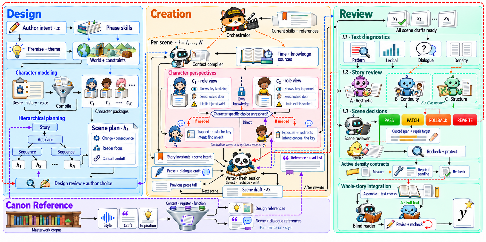

<div align="center">

# MUSE

**A Theory-Harnessed Story Engine for Vibe Narrativizing**

[简体中文](README.md) | **English**

Describe the story you want, then develop it from premise to finished prose.

[](https://arxiv.org/abs/2609.15188)

[Paper](https://arxiv.org/abs/2609.15188) · [PDF](https://arxiv.org/pdf/2609.15188) · [Citation](#citation)

[Story theory](#how-mckees-theory-guides-writing) · [Literary knowledge base](#learning-from-literary-examples) · [How it works](#how-it-works) · [Skill packages](#skill-packages) · [Quick start](#quick-start) · [Repository guide](#repository-guide)

</div>

MUSE is an AI writing system for **original fiction, screenplays, serial fiction, and derivative works**. It uses Robert McKee's story theory to guide design, retrieves examples from a literary knowledge base, and organizes character performance, scene composition, and revision.

Describe the setting, relationships, key events, atmosphere, and prose style in natural language. MUSE develops these requirements into world facts, character motivations, outlines, and scene plans. A shared workspace stores them for subsequent writing, and the final output includes the manuscript and its design and revision materials. We call the task of developing a complete story from writing requirements **Vibe Narrativizing**.

The repository also provides tools for analyzing literary works, distilling character materials, and retrieving references. Most skill instructions and knowledge-base annotations are in Chinese; the [skills collection](skills/README.md) includes a corpus guide and links to English source material.

## Paper

**[MUSE: A Theory-Harnessed Story Engine for Vibe Narrativizing](https://arxiv.org/abs/2609.15188)**

Jianxiang Ma, Xiaocui Yang, Daling Wang, Yuesong Hou, Mingfu Zhang, Yichen Gao, Junzhao Huang · arXiv, 2026

The paper explains how story knowledge becomes creative guidance and how an agent harness and context engineering carry that guidance and prior decisions through design, performance, composition, and revision. It presents experiments across four base models, component ablations, and case analyses.

## How McKee's theory guides writing

Robert McKee's *Story* examines how events, characters, and structure create narrative meaning. *Dialogue* develops the account of speech as action. MUSE draws on these principles to guide concrete decisions in story design, character performance, and revision.

| Narrative principle | Application in MUSE |
|---|---|
| **Choice under pressure** | Character design establishes pursuits, concerns, and relationships; performance reveals character through sacrifice, hesitation, or persistence |
| **Unmet expectations** | A character acts, receives an unexpected response, and changes approach. Plot design connects these actions, consequences, and subsequent choices |
| **Value change within a scene** | Scene plans specify changes in trust, freedom, safety, or intimacy; prose develops the turn through events and reactions |
| **Dialogue as action** | Characters speak to probe, reassure, demand, or evade. Speech, physical action, and context convey unspoken intentions, or subtext |
| **Controlling idea** | Conception establishes a direction; the climactic choice and its consequences develop the story's understanding of the characters' experience |

For example, a reporter trying to clear her father's name discovers that he helped falsify the records. The evidence changes her situation and forces a choice between revealing the truth and protecting her family. Revealing the truth would cost her the outcome she originally wanted, giving the final choice its weight.

MUSE uses these principles to write phase-specific skills, character materials, and review methods, with file structures and orchestration adapted for fiction and serial writing. See the skill references on [premise and controlling idea](skills/MUSE-writing/skills/phase0-conception/references/mckee-premise.md), [character design](skills/MUSE-writing/skills/phase2-character/references/mckee-character.md), [scene design](skills/MUSE-writing/skills/phase5-scene-arrangement/references/mckee-scenes.md), and [subtext](skills/MUSE-writing/skills/dialogue-craft/references/subtext-theory.md) (in Chinese).

## Learning from literary examples

The literary knowledge base stores analyses of novels, plays, and serial fiction: whole-story and phase-specific designs, character profiles, source scenes, style profiles, beat-level craft notes, and inspiration cards that explain narrative mechanisms. Dialogue events record consecutive exchanges, including their relationships, pressures, and speech actions.

During writing, the system selects a small set of relevant examples and supplies their source passages and analysis to the model as **few-shot guidance**. Each task draws on different materials:

| Creative stage | Knowledge-base materials | Decisions they support |
|---|---|---|
| **Conception** | Source premises, inspiration cards, relevant passages, and mechanism analysis | Which relationship, situation, or image can carry the intended experience |
| **Outline design** | World rules, plot spines, sequence structures, and scene analyses | How to establish causal conditions, develop conflict, and arrange revelations and climaxes |
| **Character development** | Character profiles, behavioral evidence, and consecutive dialogue exchanges | How a character chooses, responds, and speaks under the current relationship and pressure |
| **Composition** | Source scenes, style cards, and beat-level craft annotations | How to organize action, turns, narrative distance, sentence rhythm, and omission |
| **Revision** | Adopted references, design decisions, and the resulting prose | How to repair the prose while preserving the chosen style and scene intentions |

Outline designers look for how a source organizes its plot and what makes that approach work. Scene writers select passages for the character's situation and desired prose register; character rehearsal draws on dialogue with comparable relationships and pressures. Selected materials and usage guidance are saved in the workspace. Adopted inspiration accompanies the outline into writing, and revision continues to use references for their agreed purposes.

For a fairy tale that conveys a secret under surveillance, a writer can start with the [dual-meaning inspiration card](skills/MUSE-canon-distill/knowledge-base/inspiration/double-layer-code-speech.yaml), examine the [craft analysis of the corresponding scene in *Death's End*](skills/MUSE-canon-distill/knowledge-base/novels/三体Ⅲ-死神永生/craft_notes/scene_S26_beats.yaml), and read the [source scene](skills/MUSE-canon-distill/knowledge-base/novels/三体Ⅲ-死神永生/scenes/scene_S26.md). The card explains the relationship between the surface story and hidden information; the craft analysis shows the use of repetition, objects, and omissions; the source reveals where information appears, how sentences repeat, and how the scene ends. The writer applies these materials according to the new story's characters, world, and the author's intended use.

Explore the entrypoints for [design references](skills/MUSE-canon-distill/skills/design-doc-reference/SKILL.md), [character dialogue references](skills/MUSE-canon-distill/skills/dialogue-reference/SKILL.md), and [scene references](skills/MUSE-canon-distill/skills/scene-reference/SKILL.md), or browse the [corpus guide](skills/README.md#knowledge-base). Most reference materials are in Chinese.

## How it works

MUSE organizes creation through an agent harness: a coordinator assigns tasks, specialist roles design, perform, write, or review, and tools read and write the shared workspace. Each stage loads the relevant skills and earlier results, then develops the decisions made so far.

The diagram shows the full story workflow, its reference sources, and where revisions return.

[](assets/muse-method.png)

Design proceeds through premise, world, characters, plot spine, sequence structure, and scene plans. The climax determines what earlier conflicts must establish. During composition, characters work from the situation as they know it to propose actions, reactions, and lines. The writer combines scene plans, character materials, and current references to choose viewpoint, pacing, and detail.

Reviewers compare the prose with its design and return problems to the writer or the relevant design stage. Serial workflows also save chapter summaries, world facts, character history, and unresolved threads for the next chapter. Each stage reads the materials needed for its task from the shared workspace.

## Skill packages

| Package | Use it for | Main deliverables |
|---|---|---|
| [MUSE-writing](skills/MUSE-writing/README.md) | Original short and medium-length fiction; original or adapted screenplays | Story designs, character materials, drafts, reviews, and a finished manuscript |
| [MUSE-canon-distill](skills/MUSE-canon-distill/README.md) | Analyzing novels and plays; finding structural, character, dialogue, and style references | Scene analyses, character reference packages, inspiration cards, and retrieval assets |
| [MUSE-serial-writing](skills/MUSE-serial-writing/README.md) | Serial fiction, fan fiction, sequels, spin-offs, and stylistic adaptations | Series and volume plans, chapters, continuity records, and persistent series state |
| [MUSE-serial-distill](skills/MUSE-serial-distill/README.md) | Analyzing long or ongoing series; preparing continuation of an existing work | Serial reference patterns and structured handover packages |

`MUSE-canon-distill` supplies references to both writing packages. `MUSE-serial-distill` supplies serial references and continuation materials to `MUSE-serial-writing`.

## Quick start

### Use the skills in an agent workspace

Clone the repository into a workspace your agent can access:

```bash
git clone https://github.com/RoadtoAGI/MUSE.git
cd MUSE
```

Use your host's skill-loading mechanism, or ask the agent to read the entrypoint below and follow its instructions. Keep the package directory intact so its scripts, references, and role definitions remain available. Follow the linked package README for dependencies and setup.

| Your task | Entrypoint |
|---|---|
| Write a complete original short story | [short-story-writing](skills/MUSE-writing/skills/short-story-writing/SKILL.md) |
| Develop a complete original novella or a story of unspecified length | [story-writing](skills/MUSE-writing/skills/story-writing/SKILL.md) |
| Write or adapt a screenplay or stage work | [screenplay-writing](skills/MUSE-writing/skills/screenplay-writing/SKILL.md) |
| Plan a serial, sequel, or spin-off | [serial-outline](skills/MUSE-serial-writing/skills/serial-outline/SKILL.md) |
| Continue an established series with its next chapter | [serial-chapter-writing](skills/MUSE-serial-writing/skills/serial-chapter-writing/SKILL.md) |

For example:

```text
Read skills/MUSE-writing/skills/short-story-writing/SKILL.md and follow it.

Write a complete mystery set in an old observatory. The protagonist is a
retired instrument maker returning to repair a clock she built forty years
ago. Use restrained prose, a small cast, and an ending that changes the
meaning of the opening scene. Write in English. Save the work under
results/observatory-mystery/.
```

Original short fiction uses a four-stage path: conception, characters, outline, and composition with review. The complete fiction path uses eight phases. Serial fiction develops through volume and chapter cycles, with the author deciding plot direction and the workspace preserving continuity.

### Run the Python eight-phase pipeline

The standalone Python runner executes `phase0` through `phase7` from `MUSE-writing` using a configured model API. It provides tools to load skills and references, read earlier deliverables, and write each phase's output.

Use **Python 3.10+** and an **OpenAI-compatible endpoint with tool calling**. From the repository root:

```bash
python3 -m venv .venv
source .venv/bin/activate
python3 -m pip install -r requirements.txt
cp config.example.yaml config.yaml
```

Edit `config.yaml` to set `providers.compatible.base_url` and `routing.default_model`. Supply your key through `MUSE_API_KEY`; `api_key_ref: "env:MUSE_API_KEY"` already connects the configuration to that variable. A local `.env` file is also supported.

```bash
export MUSE_API_KEY='your-api-key'

PYTHONPATH=src python3 -m open_muse.main \
  --config config.yaml \
  "Write a mystery set in an old observatory. Use restrained prose and a small cast."
```

The phases run in order:

| Phase | Creative task |
|---|---|
| 0 · Conception | Establish the premise and controlling idea |
| 1 · World building | Develop the setting and world facts |
| 2 · Character | Develop desires, relationships, and character arcs |
| 3 · Spine | Shape the central conflict and plot progression |
| 4 · Structure | Organize sequences and their causal relationships |
| 5 · Scene arrangement | Plan scenes and their intended changes |
| 6 · Scene development | Draft the story |
| 7 · Integration | Review and integrate the manuscript |

Outputs are written beneath:

```text
results/<benchmark>/open-muse/<model>/<timestamp>/<query-id>/
├── story.md       # Final story selected from the generation/integration outputs
└── pipeline/      # Phase deliverables: YAML designs and Markdown drafts/reviews
```

Run logs are saved alongside the deliverables. Use `--model` to override the configured model, and `--benchmark`, `--query-id`, and `--timestamp` to label a run. Run `PYTHONPATH=src python3 -m open_muse.main --help` for all options. Generation calls your configured provider and incurs its API usage charges.

The Python runner executes the eight phases in sequence. To use knowledge-base retrieval, character rehearsal, and specialist roles, load the corresponding skill packages in an agent workspace.

### Set up literary retrieval

The [knowledge-base setup guide](skills/MUSE-canon-distill/README.md) covers retrieval dependencies and the `MUSE_KB_API_KEY`, `MUSE_KB_BASE_URL`, and `MUSE_KB_EMBEDDING_MODEL` settings. Rebuild the aggregate scene index and embeddings for your environment, using the same embedding model for indexing and queries.

For corpus organization, language coverage, and resource provenance, see the [skills collection](skills/README.md#knowledge-base).

## Repository guide

```text
MUSE/
├── README.md               # Chinese overview
├── README.en.md            # English overview
├── skills/                 # Four writing and literary-analysis packages
│   ├── MUSE-writing/
│   ├── MUSE-canon-distill/
│   ├── MUSE-serial-writing/
│   └── MUSE-serial-distill/
├── src/open_muse/          # Python agent loop, tools, and phase runner
├── tests/                  # Runtime and writing-script tests
├── config.example.yaml    # Model provider configuration template
├── requirements.txt       # Runtime dependencies
└── requirements-dev.txt   # Test dependencies
```

Within each skill package, `skills/` contains the task instructions, `references/` holds supporting material beneath individual skills, `agents/` defines specialist roles, and `scripts/` and `hooks/` support execution and validation.

## Run the tests

Install the test dependencies and run the configured runtime and writing-script suites:

```bash
python3 -m pip install -r requirements-dev.txt
python3 -m pytest
```

These suites use local fixtures and mocks and do not require API credentials.

## Citation

If you use MUSE in your research, please cite:

```bibtex
@misc{ma2026muse,
  title         = {{MUSE}: A Theory-Harnessed Story Engine for Vibe Narrativizing},
  author        = {Jianxiang Ma and Xiaocui Yang and Daling Wang and Yuesong Hou and Mingfu Zhang and Yichen Gao and Junzhao Huang},
  year          = {2026},
  eprint        = {2609.15188},
  archivePrefix = {arXiv},
  primaryClass  = {cs.CL},
  url           = {https://arxiv.org/abs/2609.15188}
}
```
