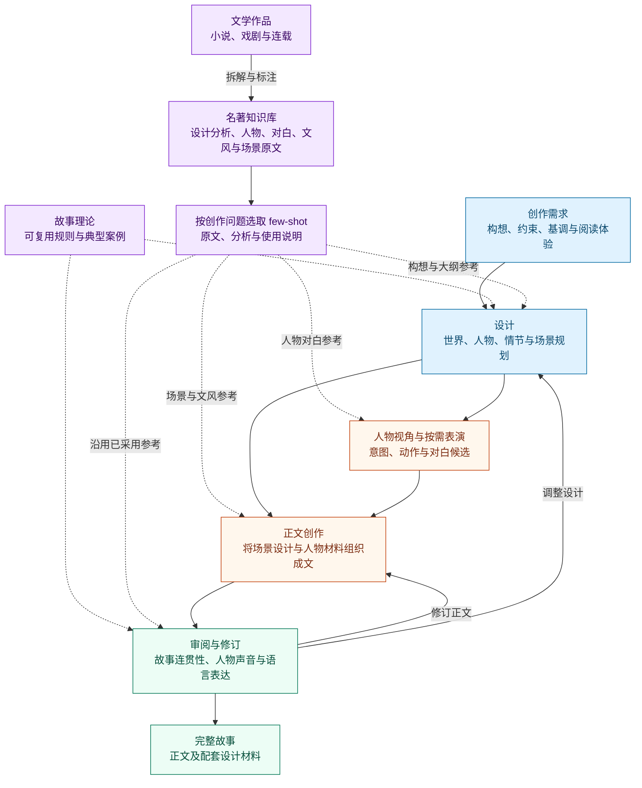

<div align="center">

# MUSE

**以故事理论组织创作的 AI 写作系统**

**简体中文** | [English](README.en.md)

从自然语言需求到完整故事，让构想、人物与情节贯穿设计、写作和修订。

[理论基础](#麦基理论如何指导创作) · [名著知识库](#名著知识库与全链路-few-shot) · [工作原理](#工作原理) · [技能包](#技能包) · [快速开始](#快速开始) · [仓库结构](#仓库结构)

</div>

MUSE 将罗伯特·麦基的故事理论、名著知识库与智能体工作流程结合起来，以原则和范例共同支持从构思到成稿的创作。你可以描述故事的设定、人物关系、关键事件、氛围和文风；系统通过设计、人物表演、场景写作与审阅修订，把这些要求发展为完整叙事。

我们将这一任务称为 **Vibe Narrativizing**。创作过程中，世界设定、人物动机、情节结构和场景设计会保存到工作区，供后续写作继续使用。交付物包括故事正文及其设计与修订材料。

本仓库包含**原创小说、剧本、连载与衍生小说**的创作技能，以及文学作品拆解、人物资料蒸馏和写作参考检索工具。技能说明与知识库标注以中文为主，语料语言和英文原文入口见[技能合集说明](skills/README.md)。

## 麦基理论如何指导创作

罗伯特·麦基的《故事》讨论事件、人物与结构如何共同产生叙事意义，《对白》进一步分析人物如何通过言语采取行动。MUSE 从中提炼出与创作决定直接相关的指导，并将其用于故事设计、人物表演和正文修订。

| 理论关注什么 | 写作时要回答的问题 | 在 MUSE 中的应用 |
|---|---|---|
| **欲望与压力下的选择** | 人物此刻想得到什么？为此愿意付出什么，又会在何处退缩？ | 人物设计建立追求与关系，场景角色材料落实当场意图与行动 |
| **行动与结果之间的鸿沟** | 现实的回应怎样偏离人物预期，迫使他改变办法？ | 情节与场景设计连接行动、后果和下一次选择 |
| **场景中的价值变化** | 这一场之后，信任、自由、安全或亲密等处境发生了什么变化？ | 场景计划明确变化，正文用事件和反应实现转折 |
| **对白中的行动与潜台词** | 人物正在用这句话试探、安抚、索取还是回避？哪些意图留在话语之下？ | 人物表演与对白写作共同组织言语、动作和关系变化 |
| **高潮与主控思想** | 最后的决定带来了什么结果？这一结果为何发生，又表达了怎样的认识？ | 构想提出表达方向，结构与结局通过人物行动发展其意义 |

例如，一名记者想替父亲洗清污名，却查到父亲参与造假。新的证据改变了她的处境，也迫使她在公开真相与保护家人之间作出选择。人物欲望、情节转折和故事意义，由同一条行动与后果的关系连接起来。

MUSE 将这些原则整理为分阶段技能、角色材料和审阅方法；具体的文件结构、调用流程与小说、连载适配由项目实现。可进一步阅读技能中的[构想与主控思想](skills/MUSE-writing/skills/phase0-conception/references/mckee-premise.md)、[人物设计](skills/MUSE-writing/skills/phase2-character/references/mckee-character.md)、[场景设计](skills/MUSE-writing/skills/phase5-scene-arrangement/references/mckee-scenes.md)和[潜台词](skills/MUSE-writing/skills/dialogue-craft/references/subtext-theory.md)。

## 名著知识库与全链路 few-shot

MUSE 建立了名著知识库，将小说、戏剧及长篇连载中的结构、人物、场景和语言组织成可检索的创作参考。**Few-shot 在这里指把少量相关范例放入当前创作上下文，让模型结合原文和分析理解一种写法。** 理论提供判断与设计原则，名著展示这些原则在具体人物、情境和语言中的实现。

作品拆解保留了多种相互关联的材料：全篇与分阶段设计分析、人物资料、场景原文、文风画像、逐节拍的手法分析，以及归纳叙事机制的灵感卡。对白事件还记录连续回合中的关系、压力和言语行动，供人物排练取材。

| 创作环节 | 使用的知识库材料 | 辅助的创作决定 |
|---|---|---|
| **构想与主题发展** | 原作构想、灵感卡、相关原文与机制解释 | 哪种人物关系、处境或形象能承载想表达的经验 |
| **世界、大纲与剧情设计** | 世界规则、情节主线、序列与场景分析 | 如何建立因果条件、组织冲突、安排揭示与高潮 |
| **人物设计与表演** | 人物档案、行为依据、连续对白事件 | 人物在当前关系和压力下如何选择、回应与表达 |
| **场景与正文创作** | 场景原文、文风卡、节拍与手法标注 | 如何安排动作、转折、叙述距离、句子节奏和留白 |
| **审阅与修订** | 已采用的参考、设计决定及对应正文 | 哪些创作意图需要进一步落实，怎样调整文风与场景表现 |

参考围绕**当前创作问题**选择：设计检索关注原作机制及其成立条件，场景检索结合人物处境与所需文风，人物对白检索关注关系、压力和回应目的。选中的原文、分析与使用说明写入本次工作区，再交给相应角色。设计阶段采纳的灵感随大纲传递到正文；修订继续使用当前有效的参考及其采用范围。

例如，要写一则“在监视下传递秘密”的童话，可以从[双层语义灵感卡](skills/MUSE-canon-distill/knowledge-base/inspiration/double-layer-code-speech.yaml)理解表层故事与隐藏信息的关系，再通过[《三体Ⅲ》相应场景的手法分析](skills/MUSE-canon-distill/knowledge-base/novels/三体Ⅲ-死神永生/craft_notes/scene_S26_beats.yaml)观察重复、道具和省略如何组织信息，最后结合[场景原文](skills/MUSE-canon-distill/knowledge-base/novels/三体Ⅲ-死神永生/scenes/scene_S26.md)理解这些选择如何形成具体的阅读体验。新作按自身人物、世界与作者指定的参考用途发展。

相关入口：[设计参考](skills/MUSE-canon-distill/skills/design-doc-reference/SKILL.md) · [人物对白参考](skills/MUSE-canon-distill/skills/dialogue-reference/SKILL.md) · [场景参考](skills/MUSE-canon-distill/skills/scene-reference/SKILL.md) · [知识库与语料说明](skills/README.md#knowledge-base)。

## 工作原理

MUSE 关注两个相互关联的问题：**怎样的指导能帮助模型做出创作决定，以及这些决定如何持续影响后续故事。** 知识工程将理论原则和案例整理成适用于具体任务的技能；智能体运行框架则通过角色分工、工具、共享文件与阶段交接，组织这些技能的使用。

完整故事工作流包含五项相互配合的职责：文学参考、设计、人物表演、正文创作、审阅与修订。



**设计把创作意图变成可继续发展的故事材料。** 完整小说工作流依次建立构想、世界、人物、情节主线、序列结构和场景计划。高潮需要什么条件，决定前面的冲突如何铺设；每个场景则推进具体的行动与变化。

**人物表演为正文提供具有角色差异的素材。** 人物在当前情境中的目标与压力，形成可能的动作、反应和对白。写作者根据场景任务选择和组织这些材料，安排视角、节奏、细节与语言。

**上下文按创作职责组织。** 设计负责人读取构想与已有设计，角色表演使用本人可知的处境，写作者取得场景计划、人物材料和当前参考，审阅者结合正文与设计判断修订方向。共享工作区保存产物，阶段交接选择本次实际需要的内容。

**审阅结果回到正文与设计。** 场景审阅和全文审阅指导修订；连载工作流还会记录章节摘要、世界事实、人物经历和未解决的伏笔，供下一章继续使用。

## 技能包

| 技能包 | 适用任务 | 主要产物 |
|---|---|---|
| [MUSE-writing](skills/MUSE-writing/README.md) | 原创短篇、中篇小说；原创或改编剧本 | 故事设计、人物材料、草稿、审阅结果与终稿 |
| [MUSE-canon-distill](skills/MUSE-canon-distill/README.md) | 小说与戏剧拆解；结构、人物、对白和文风参考检索 | 场景分析、人物参考包、灵感卡与检索资产 |
| [MUSE-serial-writing](skills/MUSE-serial-writing/README.md) | 连载、同人、续写、番外与跨文风改编 | 系列与卷章大纲、章节正文、连续性记录与系列状态 |
| [MUSE-serial-distill](skills/MUSE-serial-distill/README.md) | 长篇及在连作品分析；已有作品的接管续写准备 | 连载范式参考与结构化接管材料 |

`MUSE-canon-distill` 为两个写作包提供文学参考；`MUSE-serial-distill` 为 `MUSE-serial-writing` 提供连载参考与续写材料。

## 快速开始

### 在智能体工作区中使用技能

将仓库克隆到智能体可以访问的工作区：

```bash
git clone https://github.com/RoadtoAGI/MUSE.git
cd MUSE
```

通过当前宿主的技能加载方式使用对应入口，或让智能体读取下表中的 `SKILL.md` 并按其说明执行。保留完整的包目录，让技能可以访问配套脚本、参考材料与角色定义。各包的依赖和配置见对应 README。

| 你想完成的任务 | 技能入口 |
|---|---|
| 写一篇完整的原创短篇 | [short-story-writing](skills/MUSE-writing/skills/short-story-writing/SKILL.md) |
| 写原创中篇，或尚未确定篇幅的完整小说 | [story-writing](skills/MUSE-writing/skills/story-writing/SKILL.md) |
| 创作或改编影视、戏剧、戏曲剧本 | [screenplay-writing](skills/MUSE-writing/skills/screenplay-writing/SKILL.md) |
| 规划连载、续作或番外 | [serial-outline](skills/MUSE-serial-writing/skills/serial-outline/SKILL.md) |
| 为已有系列创作下一章 | [serial-chapter-writing](skills/MUSE-serial-writing/skills/serial-chapter-writing/SKILL.md) |

例如，可以向智能体发送：

```text
读取 skills/MUSE-writing/skills/short-story-writing/SKILL.md，按其中流程创作。

写一篇发生在旧天文台的完整悬疑短篇。主角是一位退休的仪器师，
四十年后回来修理自己制作的钟。人物数量少，语言克制，
结尾要改变读者对开场事件的理解。用中文写作，
将工作文件与正文保存到 results/observatory-mystery/。
```

原创短篇采用“构想 → 人物 → 大纲 → 成稿与审阅”的四阶段路径；完整小说采用八阶段路径。连载小说按卷、章逐步推进，由作者裁决剧情方向，工作区保存跨章连续性。

### 使用 Python 八阶段运行器

独立 Python 运行器通过模型 API，依次执行 `MUSE-writing` 的 `phase0` 至 `phase7`。它提供技能与参考加载、前序产物读取、阶段产物写入等工具。

需要 **Python 3.10+**，以及**支持工具调用的 OpenAI 兼容接口**。在仓库根目录执行：

```bash
python3 -m venv .venv
source .venv/bin/activate
python3 -m pip install -r requirements.txt
cp config.example.yaml config.yaml
```

编辑 `config.yaml`，设置 `providers.compatible.base_url` 和 `routing.default_model`。通过环境变量 `MUSE_API_KEY` 提供密钥；示例配置中的 `api_key_ref: "env:MUSE_API_KEY"` 已对应这一变量，也支持在本地 `.env` 中设置。

```bash
export MUSE_API_KEY='your-api-key'

PYTHONPATH=src python3 -m open_muse.main \
  --config config.yaml \
  "写一个发生在旧天文台的悬疑故事，语言克制，人物数量少。"
```

运行器按顺序执行以下阶段：

| 阶段 | 创作任务 |
|---|---|
| 0 · 构想 | 确立故事前提与控制思想，即故事最终表达的核心判断 |
| 1 · 世界 | 建立故事环境与世界事实 |
| 2 · 人物 | 发展人物欲望、关系与变化轨迹 |
| 3 · 主线 | 组织核心冲突与情节推进 |
| 4 · 结构 | 编排序列及其因果关系 |
| 5 · 场景编排 | 规划场景与预期变化 |
| 6 · 正文展开 | 撰写故事正文 |
| 7 · 整合 | 审阅与整合文稿 |

产物保存在以下目录中：

```text
results/<benchmark>/open-muse/<model>/<timestamp>/<query-id>/
├── story.md       # 从正文展开或整合产物中选取的最终故事
└── pipeline/      # 各阶段产物：YAML 设计与 Markdown 正文、审阅材料
```

运行日志也保存在产物目录附近。可用 `--model` 覆盖配置中的模型，用 `--benchmark`、`--query-id` 和 `--timestamp` 标记本次运行；完整参数见 `PYTHONPATH=src python3 -m open_muse.main --help`。生成过程会调用所配置的服务，并产生相应 API 费用。

上面的知识库检索、人物排练与分工交接由技能工作流组织；Python 运行器提供顺序执行八阶段的独立入口。需要使用相应专项能力时，通过智能体工作区加载对应技能包。

### 配置文学参考检索

[知识库配置说明](skills/MUSE-canon-distill/README.md)介绍了检索依赖，以及 `MUSE_KB_API_KEY`、`MUSE_KB_BASE_URL` 和 `MUSE_KB_EMBEDDING_MODEL` 的设置。使用时在目标环境中重新合并场景索引并构建向量，索引和查询使用同一个 embedding 模型。

语料组织、语言覆盖与来源说明见[技能合集的知识库介绍](skills/README.md#knowledge-base)。

## 仓库结构

```text
MUSE/
├── README.md               # 中文首页
├── README.en.md            # English overview
├── skills/                 # 四个写作与文学分析技能包
│   ├── MUSE-writing/
│   ├── MUSE-canon-distill/
│   ├── MUSE-serial-writing/
│   └── MUSE-serial-distill/
├── src/open_muse/          # Python 智能体循环、工具与阶段运行器
├── tests/                  # 运行器与写作脚本测试
├── config.example.yaml    # 模型服务配置示例
├── requirements.txt       # 运行依赖
└── requirements-dev.txt   # 测试依赖
```

每个技能包的 `skills/` 保存任务说明，各技能下的 `references/` 保存配套材料，`agents/` 定义专门角色，`scripts/` 与 `hooks/` 支持执行和校验。

## 开发与测试

安装测试依赖，运行已配置的运行器与写作脚本测试：

```bash
python3 -m pip install -r requirements-dev.txt
python3 -m pytest
```

这些测试使用本地样例与模拟调用，无需 API 密钥。
